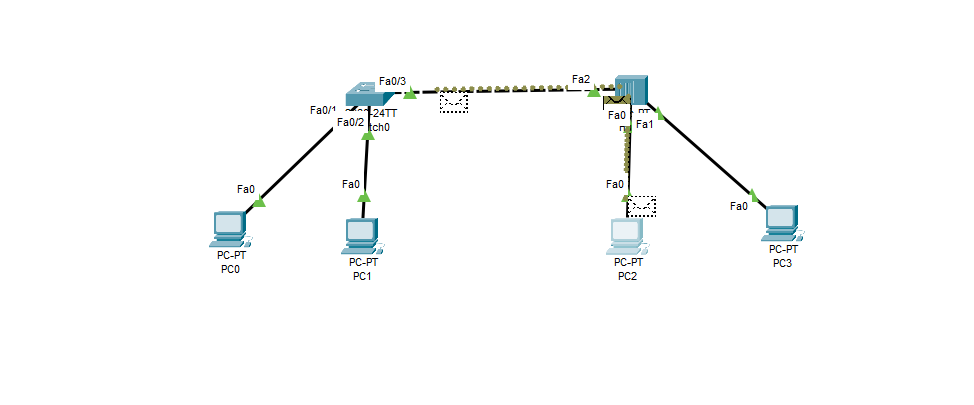

# LAN Scenario 04 – Hub vs Switch Behavior Comparison

## 🎯 Objective
Compare the behavior of a **Hub** and a **Switch** in a LAN environment by analyzing how they handle data transmission and broadcast traffic.

## 🧱 Devices Used
- 1× Hub
- 1× Switch
- 4× PCs
- Copper Straight-through cables

## 🧠 Network Topology

Two separate LAN segments:
- Segment 1: PC0 ↔ Hub ↔ PC1
- Segment 2: PC2 ↔ Switch ↔ PC3

## 🌐 IP Addressing

| Device | IP Address     | Subnet Mask     |
|--------|----------------|-----------------|
| PC0    | 192.168.1.10   | 255.255.255.0   |
| PC1    | 192.168.1.11   | 255.255.255.0   |
| PC2    | 192.168.1.20   | 255.255.255.0   |
| PC3    | 192.168.1.21   | 255.255.255.0   |

## 📷 Topology Diagram

## 🔧 Configuration
- All IP addresses are set manually via Desktop → IP Configuration.
- No routers or gateways used.
- No VLAN configuration required.
- Simple straight-through cabling.

## 📊 Observations (via Simulation Mode)

| Feature             | Hub                        | Switch                          |
|---------------------|----------------------------|----------------------------------|
| Broadcast behavior  | Sends to **all ports**     | Sends only to **destination port** after learning MAC |
| Collision domain    | Shared (one domain)        | Separate per port               |
| Performance         | Poorer                     | Better performance               |

## ✅ Test Results
- Ping between PC0 ↔ PC1: ✅ Successful
- Ping between PC2 ↔ PC3: ✅ Successful
- Broadcast traffic behavior observed in Simulation Mode:
  - Hub → all ports flash
  - Switch → targeted port after first learning

## 📁 Files Included
- `Hub-vs-Switch.pkt`: Packet Tracer lab file
- `topology.png`: Network diagram
